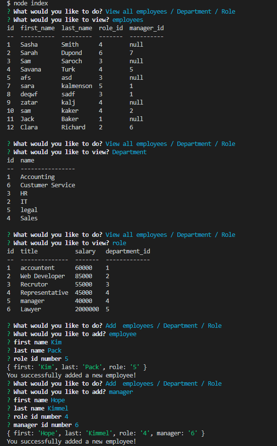

# employee-traker

## Goal

create an application to easily manage tour employee.

## Function

1. You can view all of your employees with first name, last name, id, role id and manager id.
2. You can view all the roles with their id, title, and salary.
3. You can view all the departments with their id.
4. You can add a new employee, new role or new department.
5. You can update the role of any employee.

# Instroction

Type "node index" in the console and you will have a menu withe choices. for every choice you will be guided through questions to you desire task. at the end of each task the main menu will show again.

## Links

GitHub Ripo:
https://github.com/zpinson/employee-traker

Live video:
https://drive.google.com/file/d/1IV9vY4Dw3Nh4UpKhdCUU4T4BLaZJj-38/view

## Screenshot

